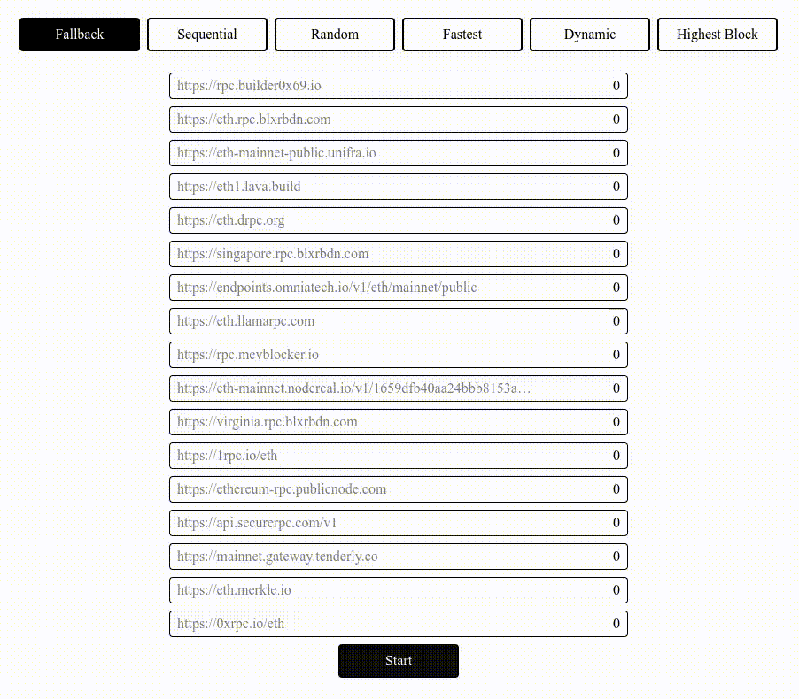
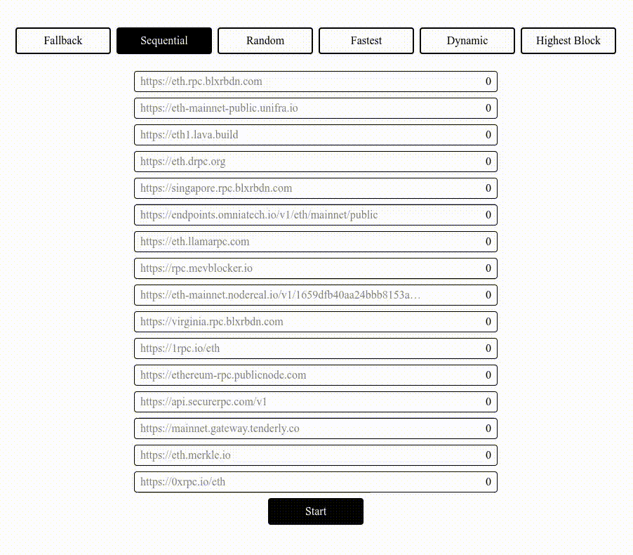
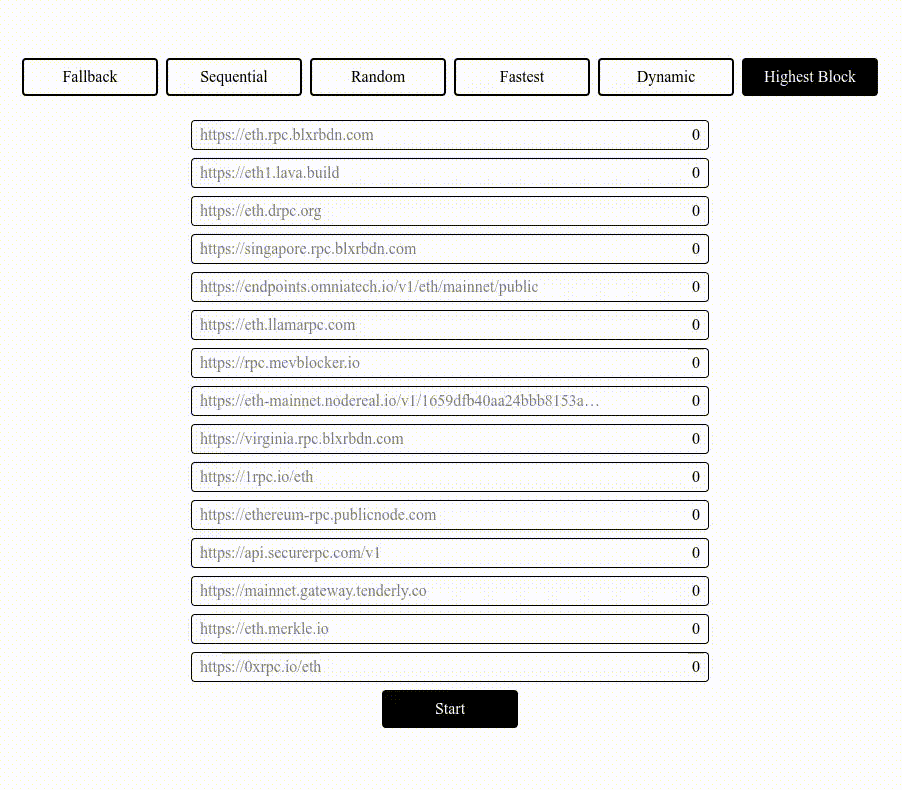
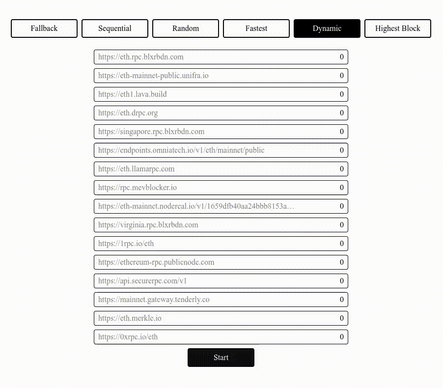

# ethers-dynamic-provider

This is a replacement of `JsonRpcProvider` for [ethers.js](https://github.com/ethers-io/ethers.js) that supports multiple RPC endpoints with various routing strategies. This will allow you to make hundreds of requests per second even for free public RPC

## Installation

```bash
npm install ethers-dynamic-provider
# or
yarn add ethers-dynamic-provider
# or
pnpm add ethers-dynamic-provider
```

## Usage

`DynamicProvider` is a powerful replacement for `JsonRpcProvider` with the same API. This means that you can simply replace the initialization of the provider and all the rest of the code will work as before, but with added benefits such as:

- Automatic failover between multiple RPC endpoints using different strategies.
- Built-in support for multicall functionality.

```diff
-  const provider = new JsonRpcProvider("https://rpc1.example.com")
+  const provider = new DynamicProvider(
+   ["https://rpc1.example.com", "https://rpc2.example.com"], // add another RPC as fallback
+   {
+     strategy: new FallbackStrategy(), // use FallbackStrategy
+     multicall: true,
+   }
+  )
```

### Built-in multicall

Multicall functionality is provided by the [ethers-multicall-provider](https://github.com/Rubilmax/ethers-multicall-provider) library

```typescript
const provider = new DynamicProvider(
  ["https://rpc1.example.com", "https://rpc2.example.com"],
  {
    strategy: new RandomStrategy(),
    multicall: true,
    // or with addition settings
    multicall: {
      cache: true,
      maxDataLength: 100_000,
    },
  }
);
```

### Jailing

When the RPC returns an error it is put into "jail" and can no longer be selected for some time. By default it is 10 seconds, but you can adjust this time (or disable it by setting 0)

```typescript
const provider = new DynamicProvider(
  ["https://rpc1.example.com", "https://rpc2.example.com"],
  {
    strategy: new RandomStrategy(),
    jailDuration: 5_000, // 5 seconds
  }
);
```

### Different strategies and RPCs for read and write requests

You can use different strategies or RPCs for read and write operations. Read operations are used when reading data from contracts, while write operations are used when sending transactions.

For example, I want to send transactions always to the same RPC:

```typescript
import {
  DynamicProvider,
  RandomStrategy,
  FallbackStrategy,
} from "ethers-dynamic-provider";

const provider = new DynamicProvider(
  {
    read: ["https://rpc1.example.com", "https://rpc2.example.com"],
    write: ["https://rpc3.example.com"],
  },
  {
    strategy: {
      read: new RandomStrategy(),
      write: new FallbackStrategy(),
    },
  }
);
```

## Available Strategies

### FallbackStrategy

Uses a primary RPC endpoint and only switches to the next one when the current RPC fails

<details>
  <summary>Visualization</summary>
  
  
</details>

```typescript
import { FallbackStrategy } from "ethers-dynamic-provider";

const provider = new DynamicProvider(
  ["https://rpc1.example.com", "https://rpc2.example.com"],
  {
    strategy: new FallbackStrategy(),
  }
);
```

### RandomStrategy

Randomly selects an RPC endpoint from the available list

<details>
  <summary>Visualization</summary>
  
  
</details>

```typescript
import { RandomStrategy } from "ethers-dynamic-provider";

const provider = new DynamicProvider(
  ["https://rpc1.example.com", "https://rpc2.example.com"],
  {
    strategy: new RandomStrategy(),
  }
);
```

### SequentialStrategy

Uses RPC endpoints in sequence, switching to the next one when number of requests to current RPC reaches `requestsPerRpc` limit

<details>
  <summary>Visualization</summary>
  
  
</details>

```typescript
import { SequentialStrategy } from "ethers-dynamic-provider";

const provider = new DynamicProvider(
  ["https://rpc1.example.com", "https://rpc2.example.com"],
  {
    strategy: new SequentialStrategy({
      requestsPerRpc: 10, // default 5
    }),
  }
);
```

### HighestBlockStrategy

Selects the RPC endpoint with the highest block number. The block number is synchronized at the first request, and then every `syncInterval` milliseconds

<details>
  <summary>Visualization</summary>
  
  
</details>

```typescript
import { HighestBlockStrategy } from "ethers-dynamic-provider";

const provider = new DynamicProvider(
  ["https://rpc1.example.com", "https://rpc2.example.com"],
  {
    strategy: new HighestBlockStrategy({
      syncInterval: 5_000, // default 10_000
    }),
  }
);
```

### FastestStrategy

Sends requests to all RPCs simultaneously and returns the first successful response

<details>
  <summary>Visualization</summary>
  
  
</details>

```typescript
import { FastestStrategy } from "ethers-dynamic-provider";

const provider = new DynamicProvider(
  ["https://rpc1.example.com", "https://rpc2.example.com"],
  {
    strategy: new FastestStrategy(),
  }
);
```

### DynamicStrategy

Analyzes response time of each RPC and selects the fastest one based on average response time of the last `historyDepth` requests

<details>
  <summary>Visualization</summary>
  
  
</details>

```typescript
import { DynamicStrategy } from "ethers-dynamic-provider";

const provider = new DynamicProvider(
  ["https://rpc1.example.com", "https://rpc2.example.com"],
  {
    strategy: new DynamicStrategy({
      historyDepth: 10, // default 5
    }),
  }
);
```
